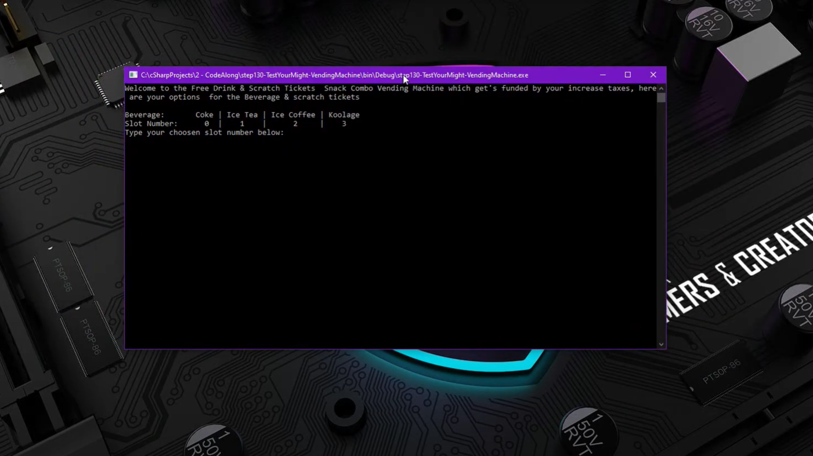

# Vending Machine Application

This is a vending Machine Console App.



I created a list of values using lists and array which is follow by 3 prompts asking the user to select one of each life.

```csharp
//List and Array
   List<string> Beverage = new List<string> { "Coke", "Ice Tea", "Ice Coffe", "Kool Aid" };
   int[] scratchTicketNumber = new int[] { 12, 7, 75, 117 };
   string[] mysterySnack = new string[] { "Sneakers Bar", "The Complete Cookie", "Beef Jerky", "Twizzlers" };

//Prompt & Store
    Console.WriteLine("Welcome to the Free Drink & Scratch Tickets  Snack Combo Vending Machine which get's funded by your increase taxes, here are your options  for the Beverage & scratch tickets\n \nBeverage:       Coke | Ice Tea | Ice Coffee | Koolage \nSlot Number:      0  |    1    |      2     |    3 \nType your choosen slot number below:");
    int selectedDrink = Convert.ToInt32(Console.ReadLine());
    Console.WriteLine("\nSratch Ticket:   12  |  7  |  75  |  117  \nSlot Number:     0   |  1  |  2   |  3\nType your choosen slot number below:");
    int selectedTicket = Convert.ToInt32(Console.ReadLine());
    Console.WriteLine("\nBeverage & scratch ticket is not complete without a mystery snack, select a number from 0-3\nType your choosen number below:");
    int selectedMystery = Convert.ToInt32(Console.ReadLine());
```

Once the selection is made if valid will vend to the user the requested items


And of course I added a response if the selection were not valid!

```csharp
//Vending Machine Logic & Output
    Console.WriteLine("\n \nProcessing Your Selection Now!");

    if (selectedDrink < 4 & selectedTicket < 4 & selectedMystery < 4)
        Console.WriteLine("Here goes your order of" + "\nDrink:   " + Beverage[selectedDrink] + "\nScratch Ticket Number: " + scratchTicketNumber[selectedTicket] + "\nAnd Finally the moment you have been waiting for, the mystery snack you have selected is:" + mysterySnack[selectedMystery]);
            else if (selectedDrink > 3)
                Console.WriteLine("That beverage selection does exist. Good Bye");
            else if (selectedTicket > 3)
                Console.WriteLine("That Scratch Ticket selection does exist. Try Again!");
            else if (selectedMystery > 3)
                Console.WriteLine("1-3 does not mean 1-" + selectedMystery + ". So Try Again!");
            else
    Console.WriteLine("Your items do not exist, are you sure you are at the right vending machine? \nIf so try again");
    Console.ReadLine();
```
